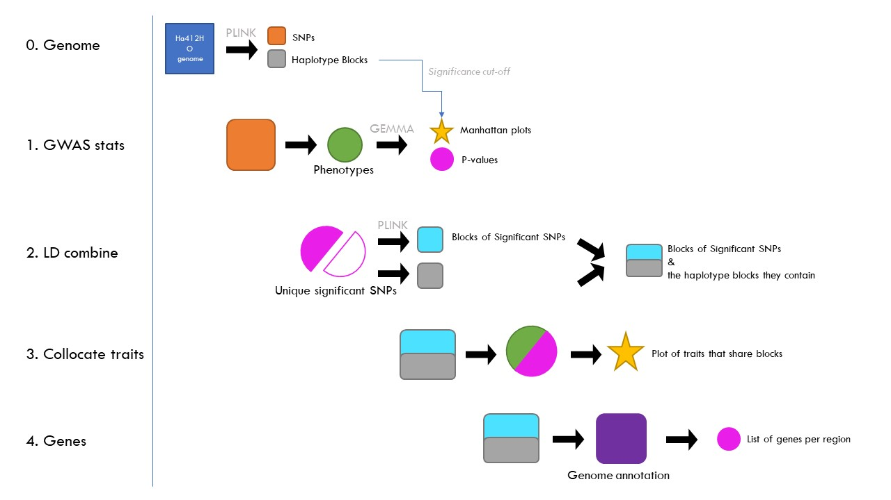

# Sunflower-GWAS-2.0

This is a R only rewrite and extention of the sunflower GWAS pipeline initiated by Rishi Masalia. (Masalia et al., Plos 2018)

This Sunflower-GWAS-2.0 pipeline adds:
- Streamlined folder structure of inputs/outputs/code/software
- GWAS calcuation using GEMMA
- Colocalization visualization using haplotype blocks
- Gene list per haplotype block
- Drawing of manhattan plots with haplotype blocks overlay

UPDATE 2019/05/10: Works like a charm. Needs software data from separate location though

Ongoing improvements:

- List R libraries needed
- Make step 0 script that had bits of code to make kinship file, blocks map, etc
- Write guide
- Flag genes that have significant SNPs for traits in gene list output
- PVE per region following Masalia et al 2018
- Heritability per region
- Epistatis graph (R2 between regions on different chromosomes (within cromosomes already captured in LD plot))

Partial guide language
- The blocks are generated from the 1.5 million SNPs using plink. This divides up the genome in chunks that are co-inherited (according to some set thresholds). We now have condensed the genome from 1.5 million independent SNPs to ~20K independent chunks/regions/blocks. Now from the GEMMA output we get a list of SNPs and their p-values. Since not all SNPs are independent (as evidenced from the blocking procedure) the cutoff for significance is based on the 20K independent blocks we have.
- Another place where the block map we've constructed really shines is finding traits that colocate to the same region. If two or more traits have SNPs that lie in the same block we can say they colocate (possibly pleiotropic but most likely close linkage). So in determining if traits have significant SNPs in the same blocks (even if the SNPs are not the same) all we have to do is figure out if they have common blocks.
- A problem with the blocking procedure is that it's sensitive to missplaced SNPs. The algorithm grows a region by walking along the chromosome and stops if a certain fraction of SNPs don't fit the region it is growing (based on D'). What could happen is that two blocks that are adjacent in reality are broken up by a miss placed cluster of SNPs. If there are traits that hit to the first part of the "true" block and traits that hit to the second part of the "true" block we would be wrong in saying these traits are independent.
- To partially protect against this we can look at the SNPs that are significant for a trait at least once, line up those SNPs and re-do the blocking. If the SNPs from two or more blocks now fully go together in a single block we know that the intervening snps could have been missplaced and for the purposes of determining colocalization we should lump the blocks together.
In the triangle plots I'm showing the LD of the SNPs. The blocks the SNPs belong to in the "genome" row, and the new, significant only SNPs, blocks in the "significant" row. 
